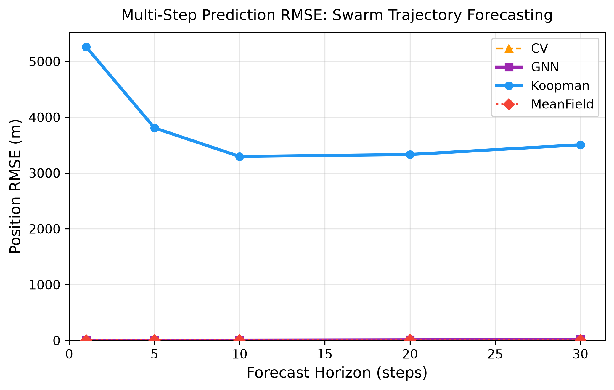

# 🛸 SwarmSwim

### Multi-Agent Swarm Trajectory Prediction using Koopman Operators & Graph Neural Networks

<p align="center">
  <b>Predicting how a swarm moves — from nonlinear interactions to structured trajectory forecasts.</b>
</p>

<p align="center">
  
</p>

---

## 🔭 Overview

**SwarmSwim** is a multi-agent trajectory prediction system developed for the **Innovation Design Project (IDP)** at **VIT Chennai**.

The project investigates how the future motion of a swarm can be predicted when every agent continuously interacts with nearby agents.

Instead of treating each agent independently, SwarmSwim models the swarm as a **dynamic interaction system** and explores two different approaches:

* 🧠 **Koopman Operator** — transforms nonlinear dynamics into a higher-dimensional feature space where evolution can be approximated linearly.
* 🕸️ **Graph Neural Network (GNN)** — represents agents as nodes and their local interactions as edges, using message passing to predict state changes.

The project also includes a vectorised **Reynolds Boids simulation**, classical baselines, multi-horizon evaluation, automated tests, and an interactive visualization dashboard.

---

## 🎯 Problem

Consider a swarm of **N = 50 agents** moving inside a 2D environment.

Each agent has a state:

$$
X_i = [x_i,\ y_i,\ v_{x_i},\ v_{y_i}]
$$

The swarm follows three primary interaction rules:

* **Separation** — avoid getting too close to neighbours.
* **Alignment** — move in a similar direction to nearby agents.
* **Cohesion** — move towards the local group.

These interactions create **nonlinear collective behaviour**, making long-horizon trajectory prediction challenging.

### Objective

Given the current swarm state:

$$
X_t
$$

predict:

$$
\hat{X}_{t+h}
$$

for multiple future horizons:

**1, 5, 10, 20 and 30 timesteps.**

---

# 🧠 Approach

## 1. Swarm Simulation

The environment implements a vectorised Reynolds-style boids model.

Each timestep combines:

```text
Separation
     +
Alignment
     +
Cohesion
     ↓
Acceleration
     ↓
Velocity Update
     ↓
Position Update
```

The simulation supports:

* 50 agents
* 100 × 100 m environment
* configurable timestep
* speed limiting
* toroidal boundaries
* multiple initial formations
* fully vectorised NumPy physics

---

## 2. 🧬 Koopman Operator

The Koopman approach addresses nonlinear dynamics by **lifting the original state into a richer feature space**.

Instead of directly learning:

$$
x_{t+1}=F(x_t)
$$

we construct:

$$
z_t=\psi(x_t)
$$

and approximate the evolution as:

$$
z_{t+1}=Kz_t
$$

where:

* \(x\) = original state
* \(\psi\) = lifting function
* \(z\) = lifted representation
* \(K\) = learned Koopman operator

### Implementation

The project uses:

* RBF feature lifting
* Extended Dynamic Mode Decomposition (EDMD)
* Tikhonov regularisation
* Linear state reconstruction
* Recursive Least Squares (RLS) for online adaptation
* Spectral-radius clamping for stability

This allows the system to investigate whether nonlinear swarm dynamics can be represented through approximately linear evolution in a richer feature space.

---

# 🕸️ Graph Neural Network

The swarm naturally forms a graph:

```text
        Agent 2
          ↕
Agent 1 ←→ Agent 3
          ↕
        Agent 4
```

### Graph representation

**Nodes**

Each agent is represented using:

```text
[x, y, vx, vy]
```

**Edges**

An edge connects agents that fall within the configured interaction radius.

The graph therefore changes as the swarm moves.

### Message Passing

Each GNN layer performs:

```text
Neighbour States
       ↓
Message Construction
       ↓
Neighbour Aggregation
       ↓
Node Update
       ↓
Updated Agent Representation
```

The implementation contains **two message-passing layers** followed by an output head that predicts the state residual:

$$
\Delta \hat X
$$

The neighbour aggregation uses summation, giving the architecture **permutation equivariance**: relabelling the agents relabels the corresponding outputs rather than changing the underlying prediction behaviour.

---

# 📊 Baselines

To provide reference points, SwarmSwim also evaluates simpler prediction strategies.

| Model                 | Idea                                                             |
| --------------------- | ---------------------------------------------------------------- |
| **Constant Velocity** | Continue each agent using its current velocity                   |
| **Mean Field**        | Approximate swarm movement using collective/centroid behaviour   |
| **Koopman**           | Predict through a lifted linear dynamical representation         |
| **GNN**               | Predict agent-level state changes using local graph interactions |

---

# 📈 Multi-Horizon Evaluation

The models are evaluated at multiple prediction horizons:

| Horizon | Lookahead |
| ------: | --------: |
|       1 |     0.1 s |
|       5 |     0.5 s |
|      10 |     1.0 s |
|      20 |     2.0 s |
|      30 |     3.0 s |

The repository contains the generated benchmark table and RMSE visualization in:

```text
results/
├── rmse_table.csv
└── rmse_curve.png
```

> **Note:** RMSE values depend on the configured dataset, simulation parameters and evaluation setup. The repository's stored results should be treated as the reference benchmark for this project version.

---

# 🏗️ System Architecture

```text
                    ┌─────────────────────┐
                    │   Swarm Simulator   │
                    │  Reynolds Dynamics  │
                    └──────────┬──────────┘
                               │
                     Agent Trajectories
                               │
                ┌──────────────┴──────────────┐
                │                             │
                ▼                             ▼
       ┌────────────────┐            ┌────────────────┐
       │ Proximity      │            │ Feature        │
       │ Graph          │            │ Lifting       │
       └───────┬────────┘            └───────┬────────┘
               │                             │
               ▼                             ▼
       ┌────────────────┐            ┌────────────────┐
       │ 2-Layer GNN    │            │ Koopman EDMD    │
       │ Message Passing│            │ + RLS           │
       └───────┬────────┘            └───────┬────────┘
               │                             │
               └──────────────┬──────────────┘
                              ▼
                  ┌────────────────────────┐
                  │ Multi-Horizon Forecast │
                  └────────────┬───────────┘
                               │
                    ┌──────────┴──────────┐
                    ▼                     ▼
             ┌─────────────┐       ┌─────────────┐
             │ Evaluation  │       │ Visualization│
             │   + RMSE    │       │  Dashboard   │
             └─────────────┘       └─────────────┘
```

---

# 📁 Project Structure

```text
swarm_review2/
│
├── sim/
│   ├── env.py              # Vectorised swarm physics
│   ├── formations.py       # Initial swarm formations
│   ├── dataset.py          # Dataset generation and rollouts
│   └── graph.py            # Dynamic proximity graph
│
├── models/
│   ├── koopman.py          # Koopman operator + EDMD + RLS
│   ├── gnn.py              # Message-passing GNN
│   ├── train.py            # Model training utilities
│   └── __init__.py
│
├── baselines/
│   ├── constant_velocity.py
│   └── mean_field.py
│
├── experiments/
│   └── evaluate.py         # Multi-horizon evaluation
│
├── configs/
│   └── default.yaml        # Experiment configuration
│
├── data/
│   ├── train.npz
│   └── val.npz
│
├── checkpoints/
│   └── koopman.npz
│
├── results/
│   ├── rmse_table.csv
│   └── rmse_curve.png
│
├── tests/                  # Automated test suite
│
├── docs/
│   └── results_report.md   # Technical report
│
├── dashboard.html          # Interactive visualization
├── run_pipeline.py         # End-to-end pipeline
├── run.bat                # Windows launcher
└── pyproject.toml          # Python project configuration
```

---

# ⚡ Quick Start

## 1. Clone the repository

```bash
git clone https://github.com/Swati-web-arch/SwarmSwim.git
cd SwarmSwim
```

## 2. Install the project

```bash
pip install -e .
```

If you are using the development/test setup:

```bash
pip install pytest
```

## 3. Run the pipeline

### Windows

```powershell
python run_pipeline.py
```

Or:

```powershell
.\run.bat
```

---

# 🧪 Run Tests

Run the complete automated test suite:

```bash
python -m pytest tests/ -v
```

The tests cover areas including:

* swarm simulation
* graph construction
* dataset generation
* baseline models
* Koopman model
* GNN behaviour
* permutation equivariance
* evaluation utilities
* numerical stability

---

# 🖥️ Interactive Dashboard

The repository also contains an interactive swarm visualization:

```text
dashboard.html
```

Open it directly in a browser or run:

```powershell
Start-Process .\dashboard.html
```

The dashboard provides a visual way to inspect swarm motion and trajectory behaviour.

---

# ⚙️ Configuration

Most experiment parameters are centralized in:

```text
configs/default.yaml
```

Example:

```yaml
swarm:
  N: 50
  world_size: 100.0
  dt: 0.1
  rollout_horizon: 30

physics:
  max_speed: 3.0
  separation_radius: 5.0
  alignment_radius: 15.0
  cohesion_radius: 20.0
```

This makes it possible to experiment with swarm size, physics parameters, prediction horizons and model settings without modifying the core implementation.

---

# 🔬 Reproducibility

Experiments use a fixed random seed:

```text
seed = 42
```

The implementation is built primarily with **NumPy**, keeping the core simulation and model implementations lightweight and easy to inspect.

---

# 🎓 Academic Context

**Innovation Design Project — Review 2**

**Institution:** VIT Chennai
**Faculty Guide:** Dr. Suneesh Jacob

### Team

* **Swati Yadav** — `25BRS1088`
* **Thati V S Sram** — `25BRS1159`
* **Ayush Choudhary** — `25BRS1209`

---

# 📚 Documentation

For the detailed methodology, mathematical formulation, architecture and experimental discussion:

📄 [`docs/results_report.md`](docs/results_report.md)

---

# 🚀 Future Directions

Possible extensions of the project include:

* Larger swarm sizes
* More diverse formation dynamics
* Learned rather than fixed feature maps
* Hybrid Koopman–GNN forecasting
* Longer prediction horizons
* Obstacle-aware trajectory prediction
* Online adaptation under changing swarm dynamics
* Real-world multi-robot trajectory datasets

---

## ⭐ Project Summary

**SwarmSwim explores a central question in multi-agent systems:**

> **Can the complex motion of a swarm be predicted by combining structured dynamical representations with local agent interactions?**

By combining **swarm simulation, Koopman operator learning, graph neural networks, classical baselines and multi-horizon evaluation**, the project provides an experimental framework for studying trajectory prediction in interacting multi-agent systems.

---

<p align="center">
  Built for the <b>Innovation Design Project</b> at <b>VIT Chennai</b> 🚀
</p>
